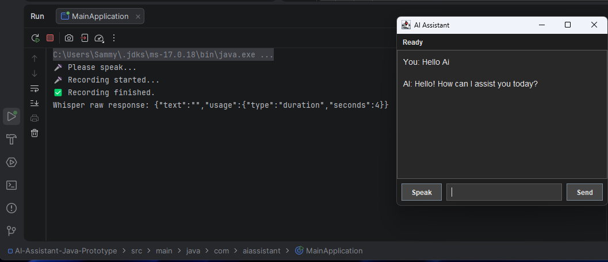

# 🎤 AI Voice Assistant (Java)

A lightweight AI-powered desktop voice assistant built with Java.

This application captures audio from the microphone, converts speech to text, sends the request to an AI model, and displays the response in a chat-style interface.

---

<!-- update -->

## 📸 Demo



---

## 🚀 Features

- 🎤 Voice recording from microphone
- 🧠 Speech-to-text processing
- 🤖 AI-generated responses using OpenAI API
- 💬 Chat-style response display
- ⚡ Lightweight Java desktop application
- 🌐 HTTP communication with external APIs

---

## 🧱 Architecture

```text
User Voice
   ↓
Audio Recording (Java)
   ↓
Speech → Text
   ↓
AI Request (OpenAI API)
   ↓
AI Response
   ↓
Display in Chat Window