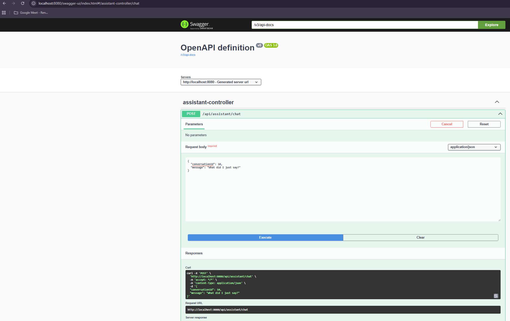
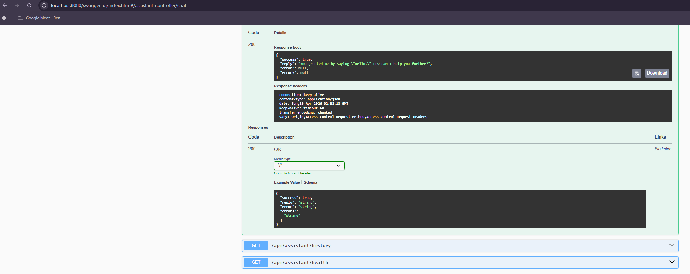

# 🚀 AI Assistant Backend (Java Spring Boot)

A Java Spring Boot backend application that integrates with OpenAI API to provide real-time AI chat responses.

The system supports conversation-based context, pagination for chat history, database persistence, service-layer testing, and interactive API testing using Swagger.

---

## Features

- Real-time AI chat responses using OpenAI integration
- REST API endpoint: `/api/assistant/chat`
- Layered architecture: Controller → Service → Repository
- Swagger UI for interactive API testing
- MySQL database integration with JPA/Hibernate
- Pagination support for chat history
- Conversation-based context handling
- Global exception handling
- Service-layer unit testing with JUnit and Mockito

---

## 🏗️ Architecture

```text
Backend (Spring Boot REST API)
↓
Controller Layer
↓
Service Layer
↓
Repository Layer (JPA)
↓
Database (MySQL)
↓
OpenAI API
```

---

## 📡 API Endpoints

### POST `/api/assistant/chat`

#### Request

```json
{
  "conversationId": 1,
  "message": "Hello AI"
}
```

#### Response

```json
{
  "success": true,
  "reply": "Hello! How can I assist you today?",
  "error": null,
  "errors": null
}
```

### GET `/api/assistant/history?page=0&size=5`

Returns paginated chat history from the database.

### GET `/api/assistant/health`

Checks whether the API is running.

---

## ⚙️ Tech Stack

- Java 17
- Spring Boot
- Spring Data JPA
- MySQL
- Maven
- OpenAI API
- Swagger / OpenAPI
- JUnit 5
- Mockito

---

## 🚀 Getting Started

### 1. Clone the repository

```bash
git clone https://github.com/soheilnajafi/AI-Assistant-Java-Prototype.git
cd AI-Assistant-Java-Prototype
```

### 2. Configure the database

Update `application.properties` with your MySQL settings:

```properties
spring.datasource.url=jdbc:mysql://localhost:3306/ai_assistant_db
spring.datasource.username=root
spring.datasource.password=YOUR_PASSWORD

spring.jpa.hibernate.ddl-auto=update
spring.jpa.show-sql=true
```

### 3. Set your OpenAI API key

Make sure your environment is configured so the OpenAI client can read your API key.

### 4. Run the application

```bash
mvn clean install
mvn spring-boot:run
```

Runs on:

```text
http://localhost:8080
```

Swagger UI:

```text
http://localhost:8080/swagger-ui/index.html
```

---

## 📂 Project Structure

```text
src/main/java/com/aiassistant
│
├── controller        # REST API layer
├── service           # Business logic
├── repository        # Database access layer
├── entity            # Database entities
├── dto               # Request / response models
├── client            # OpenAI integration
└── exception         # Global exception handling
```

---

## 📸 Demo

### API Testing via Swagger

#### Request Example



#### Response Example



---

## 🧪 Testing

This project includes unit tests for the service layer using JUnit and Mockito.

### Tested Features

- Validated successful AI response handling in the service layer
- Mocked the OpenAI client to avoid real API calls during testing
- Verified exception handling when the OpenAI service fails
- Tested service-layer interaction with the chat repository
- Verified the `/api/assistant/chat` endpoint using Swagger UI

### Testing Tools

- JUnit 5
- Mockito
- Spring Boot Starter Test
- Swagger UI

### Run Tests

```bash
mvn test
```

---

## 📌 Future Improvements

- Authentication and authorization
- Memory optimization for long conversations
- Docker support
- Cloud deployment
- Logging and monitoring improvements

---

## 👨‍💻 Author

Suhill Najafi  
Java Backend Developer | AI Integration | Spring Boot

---

## 📄 License

MIT License