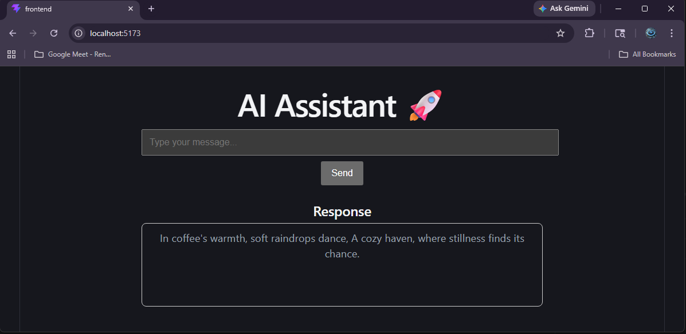

# 🚀 Full-Stack AI Assistant (Java + React)

An AI-powered assistant built with a **Spring Boot backend** and **React frontend**, integrated with OpenAI for real-time intelligent responses.

---

## 🧠 Features

- 💬 Real-time AI chat responses
- 🔗 REST API (`/api/assistant/chat`)
- ⚡ Spring Boot backend architecture
- 🎨 React frontend (UI layer)
- 🤖 OpenAI API integration
- 🧱 Clean layered architecture (Controller → Service → Client)

---

## 🏗️ Architecture

Frontend (React)
        ↓
Backend (Spring Boot REST API)
        ↓
Service Layer
        ↓
OpenAI API

---

## 📡 API Endpoint

POST `/api/assistant/chat`

### Request:
```json
{
  "message": "Hello AI"
}
```

### Response:
```json
{
  "response": "Hello! How can I help you?"
}
```

---

## ⚙️ Tech Stack

- Java 17
- Spring Boot
- Maven
- React (Frontend)
- OpenAI API
- REST APIs

---

## 🚀 Getting Started

### Backend

```bash
mvn clean install
mvn spring-boot:run
```

Runs on:
```
http://localhost:8080
```

---

## 📂 Project Structure

```
src/main/java/com/aiassistant
│
├── controller        # REST API layer
├── service           # Business logic
├── client            # OpenAI integration
└── model             # Request/Response classes
```

---

## 📸 Demo




---

## 📌 Future Improvements

- 🔐 Authentication (JWT)
- 🧠 Memory/context chat
- 🌐 Deployment (Docker + Cloud)
- 📊 Logging & monitoring

---

## 👨‍💻 Author

Suhill Najafi  
AI Engineer | Java | Backend | AI Systems

---

## 📄 License

MIT License
